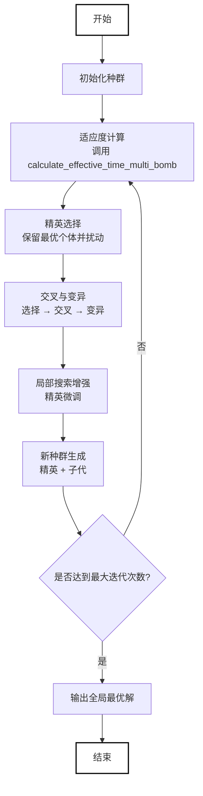

```mermaid
graph TD
    A[开始] --> B[初始化种群]
    B --> C[适应度计算\n调用 calculate_effective_time_multi_bomb]
    C --> D[精英选择\n保留最优个体并扰动]
    D --> E[交叉与变异\n选择 → 交叉 → 变异]
    E --> F[局部搜索增强\n精英微调]
    F --> G[新种群生成\n精英 + 子代]
    G --> H{是否达到最大迭代次数?}
    H -- 否 --> C
    H -- 是 --> I[输出全局最优解]
    I --> J[结束]

    style A fill:#fff,stroke:#000,stroke-width:2px
    style J fill:#fff,stroke:#000,stroke-width:2px
```