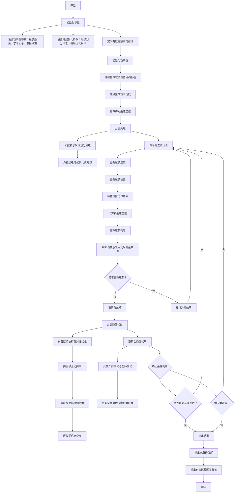

```mermaid
graph TD
    A["开始"] --> B["初始化参数"]
    B --> B1["设置粒子群参数：粒子数量、学习因子、惯性权重"]
    B --> B2["设置分层优化参数：层级划分标准、各层优化目标"]
    B --> B3["定义有效遮蔽判定标准"]
    
    C["初始化粒子群"] --> C1["随机生成粒子位置 (解空间)"]
    C1 --> C2["随机生成粒子速度"]
    C2 --> C3["计算初始适应度值"]
    B3 --> C
    
    D["分层处理"] --> D1["根据粒子属性划分层级"]
    D1 --> D2["为各层级分配优化优先级"]
    C3 --> D
    
    E["粒子群迭代优化"] --> E1["更新粒子速度"]
    E1 --> E2["更新粒子位置"]
    E2 --> E3["检查位置边界约束"]
    E3 --> E4["计算新适应度值"]
    
    F["有效遮蔽判定"] --> F1["判断当前解是否满足遮蔽条件"]
    F1 --> F2{"是否有效遮蔽？"}
    F2 -->|是| F3["记录有效解"]
    F2 -->|否| F4["标记为无效解"]
    
    G["分层局部优化"] --> G1["对各层级执行针对性优化"]
    G1 --> G2["高层级全局探索"]
    G2 --> G3["低层级局部精细搜索"]
    G3 --> G4["层级间信息交互"]
    
    H["更新全局最优解"] --> H1["比较个体最优与全局最优"]
    H1 --> H2["更新全局最优位置和适应度"]
    
    I{"终止条件判断"} --> I1{"达到最大迭代次数？"}
    I --> I2{"适应度收敛？"}
    I1 -->|是| J["输出结果"]
    I2 -->|是| J
    I1 -->|否| E
    I2 -->|否| E
    
    J --> J1["输出全局最优解"]
    J1 --> J2["输出有效遮蔽区域分布"]
    J2 --> J3["结束"]
    
    %% 流程连接
    D --> E
    E4 --> F
    F3 --> G
    F4 --> E
    G --> H
    H --> I
```